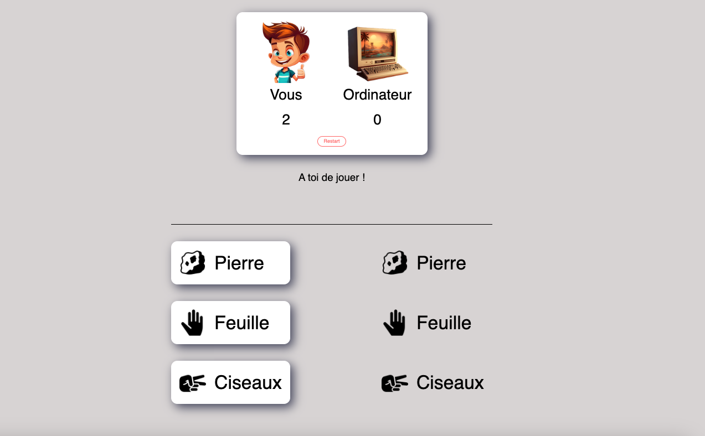

# :dart: Shifoumi (Pierre-Feuille-Ciseaux)

Ce projet est une implémentation web simple du jeu classique Pierre-Feuille-Ciseaux, permettant à un joueur d'affronter l'ordinateur.

## 📑 Description

Shifoumi, également connu sous le nom de Pierre-Feuille-Ciseaux, est un jeu de mains simple joué dans le monde entier. Le joueur choisit entre pierre, feuille et ciseaux, et l'ordinateur fait son choix aléatoirement. La pierre bat les ciseaux, les ciseaux battent la feuille, et la feuille bat la pierre.

## 💻 Technologies Utilisées
- JavaScript
- HTML
- CSS
  
## 📝 Fonctionnalités

- Interface utilisateur simple et interactive pour jouer à Shifoumi.
- Affichage des scores du joueur et de l'ordinateur.
- Bouton de réinitialisation pour recommencer la partie à zéro.
- Bouton pour passer au tour suivant après chaque manche.

## :no_entry_sign: Installation

Aucune installation n'est nécessaire. Pour jouer, ouvrez simplement le fichier `index.html` dans votre navigateur web.

## :game_die: Utilisation

1. Ouvrez le fichier `index.html` dans votre navigateur pour lancer le jeu.
2. Cliquez sur l'un des boutons Pierre, Feuille, ou Ciseaux pour faire votre choix.
3. L'ordinateur fera automatiquement son choix, et le gagnant de la manche sera affiché.
4. Le score sera mis à jour en fonction du résultat de la manche.
5. Utilisez le bouton "Tour suivant" pour continuer à jouer et le bouton "Restart" pour réinitialiser les scores et recommencer une nouvelle partie.

### 🤝 Contribution

Toute contribution est la bienvenue ! Si vous souhaitez contribuer, n'hésitez pas à soumettre une pull request.

## 📫 Contact

Pour toute question ou suggestion, n'hésitez pas à me contacter. semprini.anthony@gmail.com

Try=> https://pierre-papier-ciseaux-le-jeu.netlify.app/

